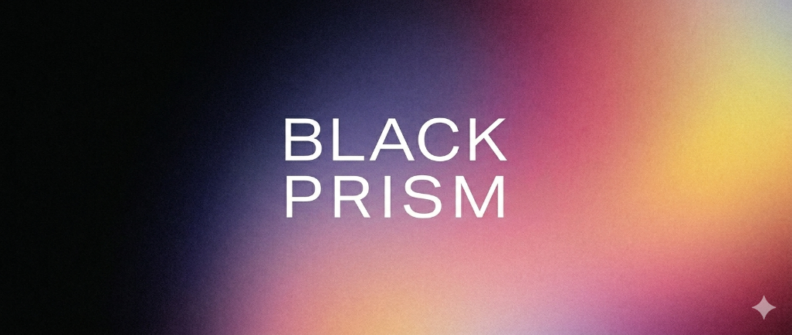

<p align="center">
  
</p>

# BlackPrism v4.0 — Post-Quantum Cryptography Suite


> **Suite avanzada de criptografía post-cuántica y seguridad de archivos de nivel militar.** Protege tus archivos y comunicaciones contra ordenadores cuánticos y adversarios avanzados mediante algoritmos oficiales del NIST para la era post-cuántica y blindajes avanzados de privacidad en disco.

> [!WARNING]
> **ESTE PROYECTO SE ENCUENTRA EN FASE DE DESARROLLO (BETA).**  
> **NO RECOMENDADO PARA USO EN PRODUCCIÓN (PROD) AÚN.**  
> Aunque la aplicación implementa algoritmos criptográficos robustos y de grado militar para la era post-cuántica, la suite está en fase activa de optimización, pruebas y auditoría de código. Utilízala bajo tu propia responsabilidad en entornos de prueba y evaluación.

---

## 📁 Estructura del Proyecto

```
blackprism/
├── 📄 README.md                ← Este archivo
├── 📄 install.sh               ← Script de dependencias automático (macOS / Linux)
├── 📄 install.ps1              ← Script de dependencias automático (Windows PowerShell)
├── 🦀 Cargo.toml               ← Dependencias y configuración Rust
├── 🔧 build.rs                 ← Script de build con permisos ACL para comandos Tauri
├── ⚙️  tauri.conf.json          ← Configuración de ventana e icono del bundle
│
├── src/                        ← Código fuente Rust (backend de alto rendimiento)
│   ├── main.rs                 ← Punto de entrada + comandos IPC Tauri
│   ├── lib.rs                  ← Declaración de biblioteca
│   ├── crypto/
│   │   ├── mod.rs              ← Módulo principal criptográfico
│   │   ├── key_manager.rs      ← ML-KEM-1024 + Dilithium-5 key gen/protect
│   │   ├── cipher.rs           ← Cifrado/descifrado completo de archivos (.qarq)
│   │   ├── shamir.rs           ← División de secretos de Shamir (Symmetric Multi-part)
│   │   ├── fragment.rs         ← Reconstrucción de fragmentos Reed-Solomon
│   │   └── pepper.rs           ← Vinculación de hardware pepper local (Machine UID)
│   └── utils/
│       ├── mod.rs              ← Utilidades generales
│       └── metadata.rs         ← Limpieza de metadatos EXIF/GPS en imágenes
│
├── ui/
│   └── index.html              ← Interfaz (HTML5 + CSS HSL + Canvas Constellation + JS)
│
└── permissions/
    └── autogenerated/          ← Permisos ACL autogenerados de comandos IPC
```

---

## Características Principales (v4.0)

### Identidad y Rebranding Premium
- **BlackPrism Branding**: Rebranding de marca completo en backend, configuraciones y frontend.
- **OLED Dark Mode**: Tema visual en negro absoluto (`#000000`) de bajo consumo con Widgets glassmorphic en escala de grises y efectos de refracción neón morados/cian.
- **Header Minimalista**: Logo de diamante/prisma 3D metálico tallado con animación sutil de pulsación y nombre `"BlackPrism"` alineado en la base.
- **Fondo de Constelación Canvas**: Un canvas interactivo que dibuja una red de partículas flotantes conectadas por líneas láser ultra-finas que siguen y reaccionan dinámicamente al cursor del ratón.

### 🔑 Gestión de Llaves PQC & Shamir's Secret Sharing
- **Generación ML-KEM-1024 + Dilithium-5**: Criptografía cuántica nativa (estándar FIPS 203 y 204).
- **Protección de Llave Privada**: Cifrado con Argon2id + ChaCha20-Poly1305.
- **Shamir's Secret Sharing (SSS)**: Divide tus contraseñas en **N fragmentos**, requiriendo un umbral de **M fragmentos** para recuperarla.
- **Exportación Segura**: Descarga automatizada bajo nombres de identidad oficiales `blackprism_identity.pub` y `blackprism_identity.key`.

### 🔐 Blindaje Criptográfico de Archivos (.qarq)
- **Cifrado Híbrido**: KEM cuántico + contraseña de doble factor opcional.
- **Ofuscación Exponencial de Tamaño**: Padding variable con buckets de base exponencial (estilo Signal) más un jitter criptográfico aleatorio, impidiendo deducir el tamaño original del archivo.
- **Hardware Pepper**: Vincula criptográficamente tus archivos al hardware físico local (Machine ID único), imposibilitando descifrarlos en otra computadora.
- **Tiempo de Vida (TTL)**: Configura una fecha de expiración para tus archivos; una vez alcanzada, el payload se bloquea permanentemente imposibilitando su descifrado.
- **Modo Duress (Señuelo)**: Si te obligan a descifrar el archivo, ingresa una contraseña señuelo configurada previamente para restaurar de forma transparente un archivo secundario inofensivo.
- **Fragmentación Reed-Solomon (Erasure Coding)**: Fragmenta el archivo `.qarq` en D partes de datos y P partes de paridad. Si pierdes hasta P fragmentos en disco, la aplicación reconstruye el original de forma transparente.

### 🧹 RAM Limpiada de Secretos (Zeroize)
- Borrado proactivo de memoria RAM al caer de ámbito (estructuras `Zeroize` de Rust), impidiendo ataques de volcado de memoria (memory dumping). Un badge animado de escoba en la consola confirma cada limpieza.

### 🗑️ Shredder — Destrucción Segura
- Destruye de forma segura archivos originales en disco mediante múltiples pases (1, 3 o 7 pases DoD militar) sobrescribiendo bytes aleatorios antes de borrarlos físicamente.

---

## 💻 Instalación y Compilación

### 🍏 macOS y 🐧 Linux
El script automático detecta tu distribución de sistema, instala Rust, Git, herramientas C++ del compilador y WebKit de forma automática:

```bash
# 1. Clonar el repositorio
git clone https://github.com/tu-usuario/blackprism
cd blackprism

# 2. Asignar permisos y ejecutar el instalador
chmod +x install.sh
./install.sh
```

---

### 🪟 Windows (PowerShell)
Ejecuta PowerShell como **Administrador** y corre el script de dependencias automático:

```powershell
# 1. Clonar el repositorio
git clone https://github.com/tu-usuario/blackprism
cd blackprism

# 2. Ejecutar instalador automatizado
Set-ExecutionPolicy Bypass -Scope Process -Force
.\install.ps1
```
El script instalará automáticamente Git, Rust, compiladores C++ Build Tools de Visual Studio y WebView2 Runtime si no se detectan en el sistema.

---

## 🔧 Especificaciones Técnicas Criptográficas

| Componente | Algoritmo estándar | Nivel de Seguridad / Tipo |
|---|---|---|
| **KEM** | CRYSTALS-Kyber / ML-KEM (NIST FIPS 203) | Post-Cuántico (1024 bits / Level 5) |
| **DSA** | CRYSTALS-Dilithium / ML-DSA (NIST FIPS 204) | Firmas Digitales Post-Cuánticas |
| **Cifrado Simétrico** | ChaCha20-Poly1305 (RFC 8439) | Cifrado Autenticado de Contenido (AEAD) |
| **Derivación de Clave** | Argon2id (RFC 9106) + HKDF-SHA3-256 | Resistencia ASIC/GPU (Doble Factor) |
| **Integridad & Hash** | SHA3-256, SHA3-512, BLAKE3, SHA-256 | Verificación modular multinivel |
| **Entropía** | OsRng (Rand Core 10 con getrandom) | Hardware aleatorio nativo |

**Plataformas Soportadas:** macOS (Apple Silicon arm64 / Intel x64), Windows (x64), Linux (x64)  
**Operación:** 100% offline, local y sin llamadas de telemetría a servidores.

---

## 📅 Historial de Versiones

| Versión | Descripción |
|---|---|
| **v4.0** | **BlackPrism Rebranding**. Tema OLED Dark, partículas en canvas. 7 Features avanzadas: Shamir's Secret Sharing (SSS), Reed-Solomon fragmentation, Hardware Pepper, TTL, Modo Duress, Signal padding y Zeroize de RAM integrado. |
| **v3.1** | Hash & Verificación independiente (5 algoritmos). Bucketing exponencial. Solución de bugs críticos de nonces en header. |
| **v3.0** | Reescritura completa a Rust + Tauri (nativa). Kyber-1024 + Dilithium-5. Shredder de destrucción segura. |
| **v2.0** | Prototipo Python con criptografía cuántica básica y GUI Tkinter. |

---

*BlackPrism v4.0 — Hecho con amor en Rust 🇲🇽. Listo para la era de la computación cuántica y la privacidad total.*
